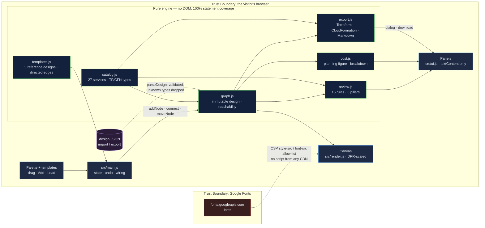

# Cloud Architecture Designer: a Well-Architected review that reads the diagram, not the parts list

[](https://github.com/Freddricklogan/cloud-architecture-designer/actions/workflows/deploy.yml)
[](#5-getting-started--verification)
[](https://github.com/Freddricklogan/cloud-architecture-designer/actions/workflows/codeql.yml)
[](LICENSE)
[](https://freddricklogan.github.io/cloud-architecture-designer/)

## 1. Executive Summary & Business Impact

**Problem statement.** Architecture reviews happen on whiteboards, and the
tools that try to help mostly check a *parts list*: "is there a WAF? is there
a KMS key?" A WAF that is not in front of anything protects nothing, and a key
that is not attached to any data store encrypts nothing. Reviewers know this;
checklists do not. The result is a green checklist over a design that would
fail a real review.

**Solution & value delivered.** A browser canvas for sketching AWS
architectures whose review engine evaluates the **graph** — what connects to
what, and in which direction — against fifteen rules across the six
Well-Architected pillars. Remove a WAF and SEC-2 fails; put it back but
forget to wire it and you get a warning naming the unprotected entry point.
Five reference architectures ship with explicit, directed connections, and
the design exports as a Terraform or CloudFormation skeleton with every
resource correctly typed and ordered by the edges you drew. No account, no
backend, no install.

**[→ Read the full case study](docs/CASE_STUDY.md)**

| Outcome | How this repo delivers it |
| --- | --- |
| A review that can be wrong in the right direction | Every rule reads topology (`reaches`, `upstream`, `downstream`); `ALB → WAF` is not protection and a test asserts it |
| A score a reviewer can defend | 0–100 over *applicable* rules only (pass 1 · warn 0.5 · fail 0); "not applicable" is a distinct state, never a free pass |
| Reference designs that are actually references | Each of the five templates instantiates with no orphans and passes the security pillar outright — enforced in the test suite |
| A starting point for infrastructure code | Terraform (`aws_*`) and CloudFormation (`AWS::*`) skeletons with `depends_on` / `DependsOn` from the graph; every attribute you must decide is `TODO`, none is invented |
| Findings that survive review | 110 tests over the pure modules at 100% statement coverage; the JSON importer is fuzzed with malformed input |

> **Scope, stated plainly.** The cost figure is a sum of round planning
> placeholders per service, not AWS list prices — the panel says so beside the
> number. The rules are a teaching approximation of what an architect looks
> for on a whiteboard, not the AWS Well-Architected Tool's question set.

## 2. Demonstrated Competencies & Technical Skills

- **Systems Architecture & CS** — An immutable design graph
  (`src/graph.js`) with breadth-first reachability, hit-testing and clamped
  geometry; every mutation returns a new design, which is what makes undo a
  one-line feature and the rules pure functions. Fifteen rules as data
  (`src/review.js`), each a function of the graph, scored per pillar.
- **Data Science & AI** — n/a. The scoring is deterministic weighting, not
  inference, and is described as such.
- **Cybersecurity & Compliance** — `default-src 'none'` CSP with no inline
  script, style or handlers; a JSON importer that drops unknown types,
  duplicate ids and dangling edges with warnings; every user-supplied string
  rendered through `textContent`; CodeQL and Trivy in CI. Five of the fifteen
  rules are security rules, and they are the strictest — three can *fail*.
- **EdTech & Human-Centered Design** — A canvas is invisible to a screen
  reader, so the **Inventory** panel exposes every component with the same
  actions; every palette item has an Add button; `Delete`, arrow keys and
  `Escape` work; state changes are announced; the five-step tour breaks the
  design on purpose and repairs it so the learner sees the rule *react*.

## 3. System Architecture & Data Flow



No script is loaded from any CDN and no network call leaves the page after
the font. `connect-src 'none'`.

## 4. Technical Highlights & Engineering Decisions

### ADR-1 — Rules read the graph, because a parts list cannot be wrong

**Context.** The previous build reduced the design to a set of service types
and every rule was a membership test: `types.has('waf') ? 'pass' : 'warn'`. A
WAF anywhere on the canvas passed "WAF protection"; "Right-sized resources"
passed whenever the canvas was non-empty. The connections the user drew
changed nothing.

**Decision.** Edges became directed and the model gained `reaches`,
`upstream` and `downstream`. Every rule is a function of the graph: `SEC-2`
walks the inbound path of each public entry point looking for a WAF; `REL-1`
counts compute targets behind each load balancer; `SEC-5` fails when an edge
service connects straight to a database.

**Consequence.** The review can now be *wrong in the right direction* — a
disconnected WAF earns a warning that names the unprotected entry point, and
`ALB → WAF` (wrong direction) earns nothing. That made it possible to write a
test that every reference template passes the security pillar outright, which
immediately found four wiring gaps in the templates themselves (IAM not
reaching every compute service; KMS and Secrets Manager not attached to
caches). The templates were fixed rather than the test.

### ADR-2 — Templates declare edges; nothing is auto-connected

**Context.** Templates listed nodes and the code wired each to the next in
the array if they were vertically within 200 px. The three-tier template
produced `ElastiCache → RDS → S3 → IAM → WAF`. Because the rules ignored
edges (ADR-1), nobody could tell.

**Decision.** Every template lists its edges as `[from, to]` pairs in the
direction traffic flows, and `instantiateTemplate` throws on an unknown key.

**Consequence.** A template's topology is data — reviewable in a diff and
covered by a test that asserts no orphans and no failing rule. The cost was
writing out 91 edges by hand for five templates, which is exactly the work
that makes them reference architectures instead of pictures.

### ADR-3 — Export a skeleton with `TODO`s rather than a plausible stack

**Context.** A Terraform export is the feature reviewers ask for, and the
tempting version fills in instance types, CIDR blocks and engine versions so
the output looks deployable.

**Decision.** Emit each resource with its correct provider type
(`aws_db_instance`, `AWS::RDS::DBInstance`), a `Name` / `Category` tag, and
`depends_on` derived from the design's upstream edges. Every attribute an
engineer must decide is a `TODO` comment.

**Consequence.** Nothing in the output is invented, so a reviewer can trust
all of it; the `depends_on` graph — the part that is genuinely tedious to
write by hand — is the part the tool contributes. Resource names are
sanitised and de-duplicated (`ec2_web`, `ec2_web_2`; `EC2Web`, `EC2Web2`) so
two nodes with the same display name never collide.

## 5. Getting Started & Verification

**Prerequisites.** Node 22 LTS (or any Node ≥ 20). No build step — the page
runs from the repository root as plain ES modules.

```bash
git clone https://github.com/Freddricklogan/cloud-architecture-designer.git
cd cloud-architecture-designer
npm install
npm run serve      # http://localhost:3000
```

**Verification — the numbers this repository actually produced:**

```bash
npm test         # Test Files 6 passed (6) · Tests 110 passed (110)
npm run coverage # All files 100% statements · 98.19% branches
npm run lint     # eslint . — clean
npm run validate # html-validate index.html — clean
```

| Check | Result |
| --- | --- |
| Unit tests | **110 passed / 110** across 6 files |
| Statement coverage (engine) | **100%** (branches 98.19%) |
| ESLint | clean |
| html-validate | clean (`no-inline-style` enforced) |
| Headless Chrome smoke | **0 console errors**; all five tour steps change state (score 97 → 90 with 1 failing check → 97); Terraform and CloudFormation exports each emit 15 resources for the three-tier template; undo, keyboard delete, JSON import round-trip and palette Add verified; no horizontal scroll at 400 px |
| Reference templates | 5 / 5 instantiate with no orphans and no failing rule; scores 97 · 100 · 96 · 100 · 100 |

Coverage is measured over the pure modules (`catalog`, `graph`, `templates`,
`cost`, `review`, `export`). `src/main.js`, `src/render.js`, `src/ui.js` and
`src/exec-shell.js` are binding layers, excluded from the target and covered
by the browser smoke test instead. `AUDIT.md` lists every defect found in the
previous build with line numbers.

## 6. Live Demo & Production Showcase

**<https://freddricklogan.github.io/cloud-architecture-designer/>**

No account, no credentials, no backend.

**30-second guided walkthrough.** Press **Take the 30-second tour**; all five
steps perform the action they describe.

1. **Load a reference architecture** — the three-tier web application: 15
   components, 22 directed connections, score 97.
2. **Read the review** — fifteen rules across six pillars; every note names
   the component it is talking about.
3. **Break it on purpose** — removes the WAF. SEC-2 flips from pass to
   *fail* and the score drops to 90.
4. **Repair it** — adds a WAF back *and wires it to CloudFront*. SEC-2 returns
   to pass. (Adding it unwired would have earned only a warning.)
5. **Export a Terraform skeleton** — 15 typed resources ordered by
   `depends_on`, attributes marked `TODO`.

Prefer to drive it yourself: drag services from the palette (or press **+**
on any of them), shift-click two nodes to connect them in the direction
traffic flows, and watch the score and the cost breakdown update. **Design
JSON** round-trips through **Import JSON**; **Review report** gives you the
findings as Markdown for a design document.

> **Deployment note.** Pages serves `index.html` from the repository root via
> `.github/workflows/deploy.yml`. **Settings → Pages → Source must be set to
> "GitHub Actions"** for the workflow to publish.
